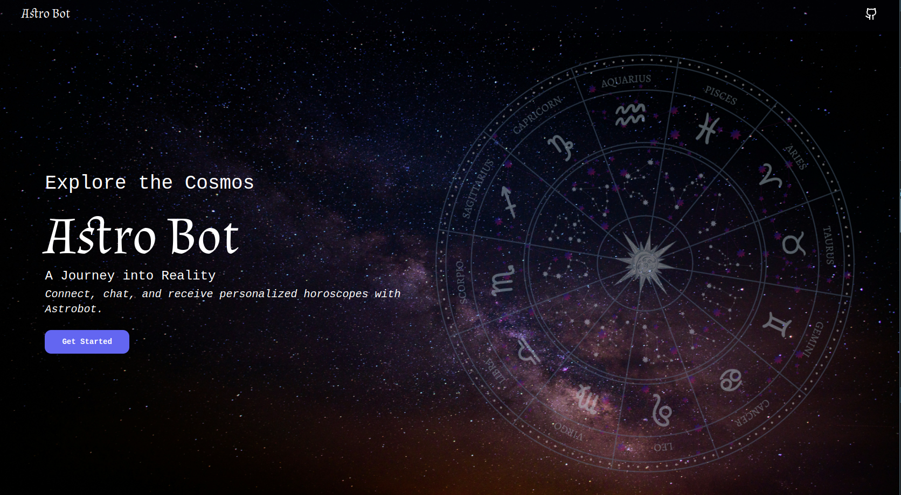
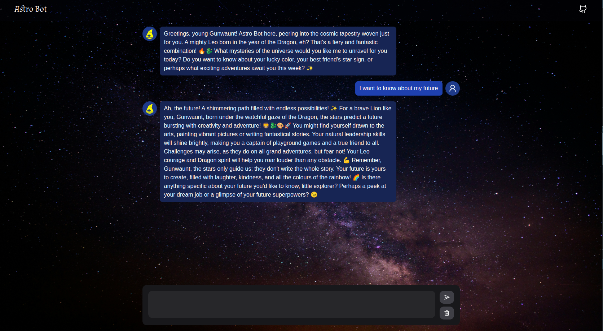

# Astro Bot

## Product Overview

Astro Bot is a conversational interface designed to provide users with astrological predictions and insights based on their personal information. The bot collects initial user details and delivers customized astrology content according to user queries.

<!-- link -->
[Visit Astro Bot](https://astro-bot-one.vercel.app/)

## Key Features

1. **Welcome Page**: Users are greeted with a friendly welcome page upon interaction.
2. **Data Collection**: Collects user's name, age, DOB, and star sign via a simple chat interface.
3. **Prediction Delivery**: Provides personalized astrological predictions based on user details and queries.

## Tech Stack
  - Next.js
  - TypeScript
  - NextUI (for UI components)
  - Lucide Icons (for icons)
  - Vercel AI SDK (for streaming and other functionality)
  - Gemini-Pro (AI model for astrological predictions)

## Images

### Welcome Page

### Chat Interface

## Conclusion

Astro Bot is designed to offer a seamless and engaging astrological experience to users. With its friendly and knowledgeable tone, it aims to provide personalized astrological insights based on user inputs in real-time. The bot's design ensures compatibility across various platforms, making it accessible and easy to use.